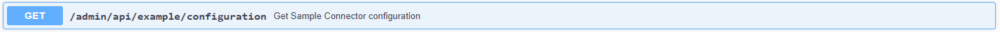

At first, clone the repository: `git clone https://github.com/FraunhoferISST/DataspaceConnector.git`.


If you want to setup the connector application yourself, follow the instructions below. If you 
encounter any problems, please have a look at the [FAQ](https://github.com/FraunhoferISST/DataspaceConnector/wiki/faq). 

## Configurations

The resource folder `conf` provides three important files that are loaded at application start:

* `keystore-localhost.p12`: The provided keystore, on the one hand, is used as IDS certificate that 
is loaded by the IDS Framework for requesting a valid Dynamic Attribute Token (DAT) from the Dynamic 
Attribute Provisioning Service (DAPS). Each message to an IDS participant needs to be signed with a 
valid DAT. On the other hand, it is used as SSL certificate for TLS encryption.
* `truststore.p12`: The truststore is used by the IDS Framework for any HTTPS communication. It 
ensures the connection to trusted addresses.
* `config.json`: The configuration is used to set important properties for IDS message handling.

**Step 1** 

When starting the application, the `config.json` will be scanned for important connector 
information, e.g. its UUID, its address, contact information, or proxy settings. Please keep this 
file up to date to your own connector settings. In case you are using the demo cert, you don't need 
to change anything except the [**proxy settings**](#proxy). 

> **Note**: If you are not familiar with the IDS Information Model, the `MainController` class provides an 
endpoint `GET /admin/api/example/configuration` to print a filled in Java object as JSON-LD. Adapt 
this to your needs, take the received string and place it in the `config.json`.
>
> 

> **Note**: If you want to connect to a running connector or any other system running at `https`, 
> keep in mind that you need to add the keystore to your truststore. Otherwise the communication 
> will fail. With the provided truststore, the Dataspace Connector accepts its own localhost 
> certificate, public certificates, and any IDS keystore that was provided by the Fraunhofer AISEC.

**Step 2**

In the provided `config.json`, the `ids:connectorDeployMode` is set to `idsc:TEST_DEPLOYMENT`. This 
allows to use the `keystore-localhost.p12` as an IDS certificate. For testing purpose, the existing 
cert can be used, as on application start, the IDS Framework will not get a valid DAT from the DAPS 
and for received messages, the sent DAT will not be checked. 

To turn on the DAT checking, you need to set the `ids:connectorDeployMode` to `idsc:PRODUCTIVE_DEPLOYMENT`. 
For getting a trusted certificate, contact [Gerd Brost](mailto:gerd.brost@aisec.fraunhofer.de). 
Add the keystore with the IDS certificate inside to the `resources/conf` and change the filename at 
`ids:keyStore` accordingly. In addition, set your connector id to the IDS certificate's name (UUID) to 
uniquely identify your connector towards e.g. the IDS metadata broker:

```
"ids:connectorDescription" : {
    "@type" : "ids:BaseConnector",
    "@id" : "https://w3id.org/idsa/autogen/baseConnector/xxx",
```

> **Important**: The `test deployment` and accepting a demo cert is for testing purposes only! This 
> mode is a security risk and cannot ensure that the connector is talking to a verified IDS 
> participant. Furthermore, messages from the Dataspace Connector without a valid IDS certificate 
> will not be accepted by other connectors.

**Step 3 (optional)** 

The `application.properties` specifies database, SSL, spring security, open API, and DAPS configurations. 
To define on which port the connector should be running, change `server.port={PORT}`. 
If you want to add your own SSL certificate, check the corresponding path. 
    
> **Note**: As the provided certificate only supports the application running at `localhost`, you 
> may replace this with your IDS keystore, if you want to host the connector in a productive 
> environment.

### Proxy

For outgoing requests, the connector needs information about an existing system proxy that needs to 
be set in the `src/main/resources/conf/config.json`.

```
"ids:connectorProxy" : [ {
    "@type" : "ids:Proxy",
    "@id" : "https://w3id.org/idsa/autogen/proxy/548dc73a-ccfb-4039-9569-4b8e219b90bc",
    "ids:proxyAuthentication" : {
      "@type" : "ids:BasicAuthentication",
      "@id" : "https://w3id.org/idsa/autogen/basicAuthentication/47e3cd59-d351-4f5b-99fc-561c94bad5e1"
    },
    "ids:proxyURI" : {
      "@id" : "http://host:port"
    },
    "ids:noProxy" : [ {
      "@id" : "https://localhost:8080/"
    }, {
      "@id" : "http://localhost:8080/"
    } ]
  } ]
```

Check if your system is running behind a proxy. If this is the case, specify the `ids:proxyURI` and 
change `ids:noProxy` if necessary. Otherwise, delete the key `ids:connectorProxy` and its values.


### Authentication
The application uses HTTP Basic Authentication. Each endpoint behind `/admin/**` needs a user authentication. 

Have a look at the blocked endpoints in the `ConfigurationAdapter` class to add or change endpoints 
yourself. In case you don't want to provide authentication for your backend maintenance, feel free 
to remove the corresponding lines.

If you want to change the default credentials, go to `application.properties`. The properties are 
located at `spring.security.user.name` and `spring.security.user.name`.

### Database

The Dataspace Connector uses Spring Data JPA to set up the database and manage interactions with it. 
Spring Data JPA supports many well-known relational databases out of the box. Thus, the internal H2 
can be replaced by e.g. MySQL, PostgreSQL, or Oracle databases with minimal effort.

To use another database for the Dataspace Connector, follow [these](https://github.com/FraunhoferISST/DataspaceConnector/wiki/database-configuration) steps.

### Logging

The Dataspace Connector provides multiple ways for logging and accessing information. Please find a
detailed description on how to set up static and runtime configurations [here](https://github.com/FraunhoferISST/DataspaceConnector/wiki/logging).

## Deployment

In the following, the deployment with Maven and Docker will be explained.

### Maven Build    

If you want to build and run locally, ensure that at least Java 11 is installed. Then, follow these steps:

1.  Execute `cd dataspace-connector` and `mvn clean package`.
2.  The connector can be started by running the Spring Boot Application. Therefore, navigate to 
`/target` and run `java -jar dataspace-connector-{VERSION}.jar`.
3.  If everything worked fine, the connector is available at https://localhost:8080/. By default, 
it is running with an h2 database.

> **Note**: After successfully building the project, the Javadocs as a static website can be found 
> at `/target/apidocs`. Open the `index.html` in a browser of your choice.

> **Note**: The `pom.xml` provides three Maven profiles: `no-documentation`, `no-tests`, and 
> `release`. The first one skips the Javadocs generation, the second one skips the execution of 
> tests. The `release` profile shows all warnings and errors. To run a profile, please have a look at 
> [this guide](maven.apache.org/guides/introduction/introduction-to-profiles.html#details-on-profile-activation).

### Docker Setup

If you want to deploy in Docker and build the Maven project with the 
[Dockerfile](https://github.com/FraunhoferISST/DataspaceConnector/blob/develop/Dockerfile), follow these steps:

**Option 1: Build and run Docker image**
1. Navigate to `dataspace-connector`. To build the image, run `docker build -t <IMAGE_NAME:TAG> .` 
(e.g. `docker build -t dataspaceconnector .`). 
2. For running your image as a container, follow [these](https://docs.docker.com/get-started/part2/) 
instructions: `docker run --publish 8080:8080 --detach --name bb <IMAGE_NAME:TAG>`

**Option 2: Using Docker Compose**
1. The `docker-compose.yml` sets up the connector application and a PostgreSQL database. If 
necessary, make your changes in the `connector.env` and `postgres.env`. Please find more details 
about setting up different databases [here](https://github.com/FraunhoferISST/DataspaceConnector/wiki/database-configuration).
2. For starting the application, run `docker-compose up`. Have a look at the `docker-compose.yaml` 
and make your own configurations if necessary.

If you just want to run a built jar file (with an H2 database) inside a docker image, have a look 
at the `Dockerfile` inside the [`docker-setup.zip`](https://github.com/FraunhoferISST/DataspaceConnector/releases).

### Run Tests

Tests will be executed automatically when running Maven commands `package`, `verify`, `install`, 
`site`, or `deploy`. An overview of the implemented test classes is placed [here](https://github.com/FraunhoferISST/DataspaceConnector/wiki/software-tests).
To run tests manually, execute the following commands in the root directory of the project:

Run all tests
```
mvn test
```
Run specific test class
```
mvn test -Dtest=[full class name]
```
        
Run a specific test case (single method)
```
mvn test -Dtest=[full class name]#[method name]
```

### Backend API

The OpenApi documentation can be viewed at https://localhost:8080/admin/api. 
The JSON representation is available at https://localhost:8080/v3/api-docs. 
The .yaml file can be downloaded at https://localhost:8080/v3/api-docs.yaml.

#### OpenApi

The connector provides several endpoints for resource database handling and IDS messaging. Details 
on how to interact with them can be found [here](https://github.com/FraunhoferISST/DataspaceConnector/wiki/ids-communication-guide).

*  `Connector: Selfservice` provides information about the running connector and settings for contract 
negotiation and policy enforcement behaviour.
*  `Connector: Resource Handling` provides endpoints for local data resource management 
(`POST`, `PUT`, `GET`, and `DELETE` metadata).
*  `Backend: Resource Data Handling` provides endpoints for local data management (`PUT` and `GET` 
data - by representation).
*  `Connector: IDS Connector Communication` provides endpoints for requesting artifact (data) 
and descriptions (metadata) from an external connector, and negotiate contracts.
*  `Connector: IDS Broker Communication` provides endpoints for IDS broker messages.
*  `Examples` provides endpoints for testing purpose.

Next to the endpoint implemented by the connector, an endpoint for handling incoming IDS messages 
at `/api/ids/data` is provided by the IDS Framework.

#### Database

The data resources are persisted in an H2 database.

*  Local datasource: `/target/db/resources`
*  Console path: https://localhost:8080/admin/database

## Example Setup

An instance of the Dataspace Connector is currently available in the IDS Lab at 
https://simpleconnector.ids.isst.fraunhofer.de/. 
It can only be reached from inside a VPN network. To get your IP address unblocked, please contact 
[us](mailto:info@dataspace-connector.de).
* The connector self-description is available at https://simpleconnector.ids.isst.fraunhofer.de/ (GET).
* The **open endpoint for IDS communication** is https://simpleconnector.ids.isst.fraunhofer.de/api/ids/data (POST).
* The backend API (available at `/admin/api`) and its endpoints are only accessible to users with credentials. 

**Testing:**
1. When requesting the connector's self-description, the included catalog gives information about 
available resources. The resource id (e.g. https://w3id.org/idsa/autogen/resource/[resource-id]) is 
essential for requesting an artifact or description.
2. The open endpoint at `/api/ids/data` expects an `ArtifactRequestMessage` with a known artifact id 
as `RequestedArtifact` (for requesting data) or a `DescriptionRequestMessage` with a known resource 
id as `RequestedElement` (for requesting metadata). 
    * If this parameter is not known to the connector, you will receive a `RejectionMessage` as response. 
    * If the `RequestedElement` is missing at a `DescriptionRequestMessage`, you will receive the 
    connector's self-description.
