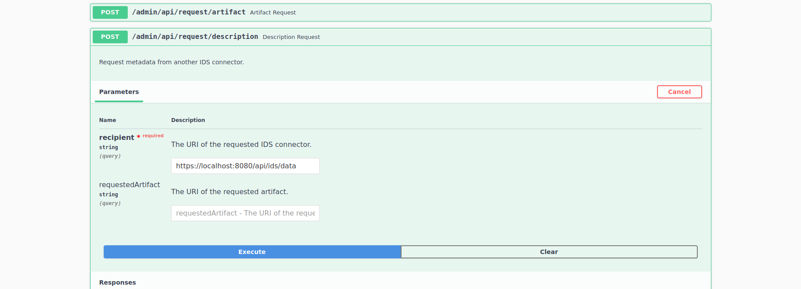

At first, clone the repository: `git clone https://github.com/FraunhoferISST/DataspaceConnector.git`.

If you want to deploy the connector yourself, follow the instructions of the [Development](https://github.com/FraunhoferISST/DataspaceConnector/wiki/development) 
section. If you do not want to build the connector yourself and just want to see how two connectors 
communicate, take a look at the **two test setups placed at the corresponding 
[release](https://github.com/FraunhoferISST/DataspaceConnector/releases)**. 
Both test setups provide a connector as a data provider and one as a data consumer.

## Java Setup

Extract the provided `java-setup.zip` file. Make sure you have Java 11 installed and both `.jar` files 
inside their own folder. The data provider will be running at http://localhost:8080 and the consumer 
at http://localhost:8081.

For requesting data from the provider, open the Swagger UI of the consumer 
(http://localhost:8081/admin/api with `admin` + `password`) and send a request as shown below. 
Due to the missing requested resource, the self-description of the provider is returned in response. 
To request a specific resource, it has to be created in the provider first.
A more detailed explanation can be found [here](https://github.com/FraunhoferISST/DataspaceConnector/wiki/ids-communication-guide).

## Docker Setup 

Extract the provided `docker-setup.zip` file. Make sure you have Docker Compose installed and run 
`docker-compose build --no-cache` and then `docker-compose up` inside the extracted folder. 
In doing so, the provided `.jar` files will be built up as Docker Images and started as a data 
provider running at http://localhost:8080/ and a data consumer running at http://localhost:8081/.

For requesting data from the provider, please remind that all applications are running inside 
isolated docker containers. So don't request e.g. http://localhost:8080/api/ids/data but http://provider:8080/api/ids/data.
