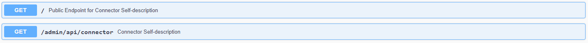
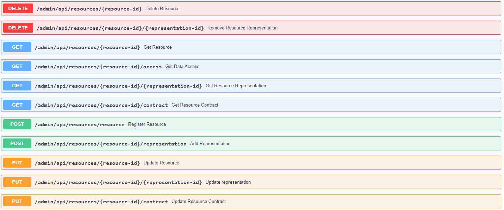
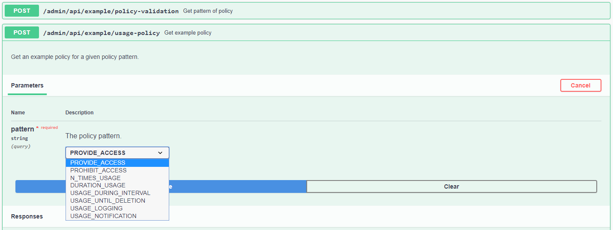
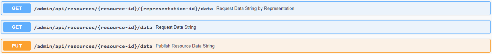
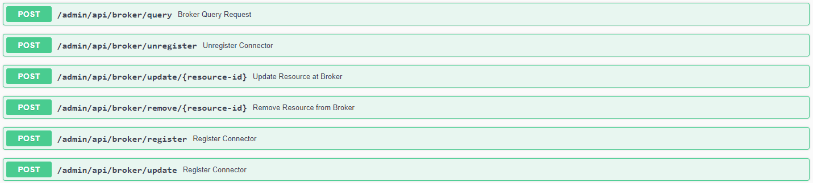
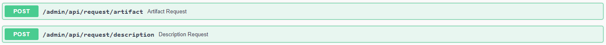
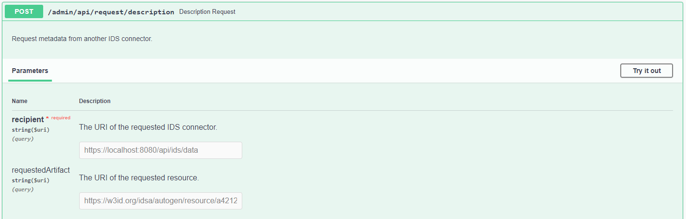
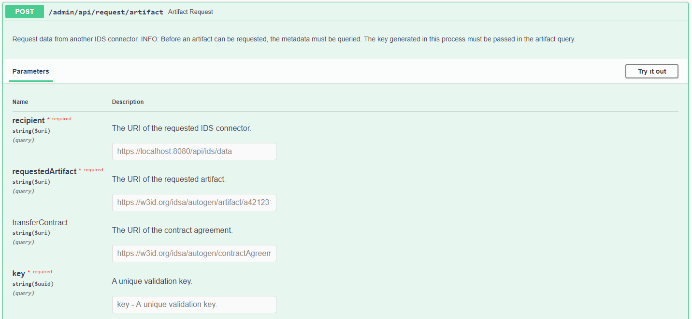
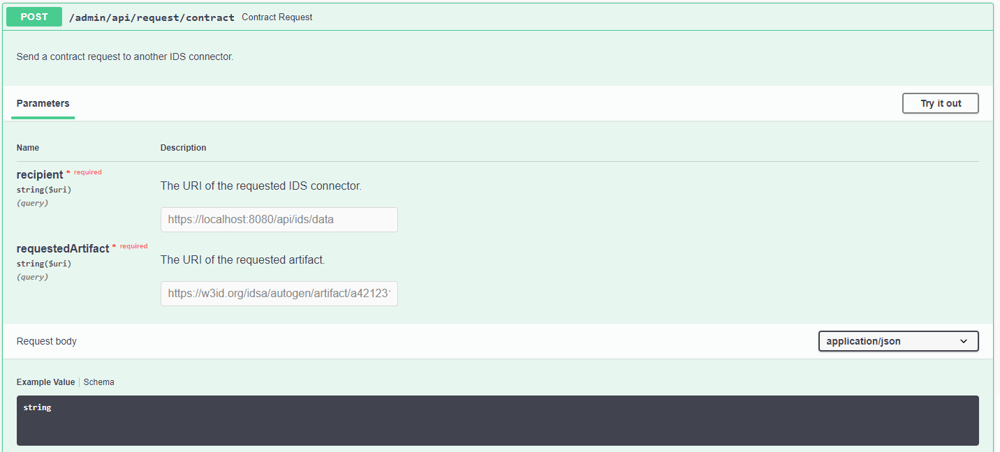
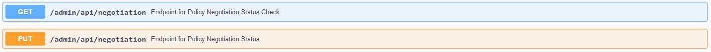

To interact with the running application, the provided [endpoints](https://github.com/FraunhoferISST/DataspaceConnector/wiki/development#backend-api) can 
be used - either automated by an application or manually by interacting with the Swagger UI. In the 
following, it is explained how to provide data with a connector (from internal and external database) 
and how to consume this from another one.

First of all, the connector provides an endpoint for requesting its self-description. 
The self-description is returned as JSON-LD string and contains several information about the running 
connector instance. This includes e.g. the title, the maintainer, the Information Model version, and 
the resource catalog. At the public endpoint `/`, the resource catalog is not displayed. It can only
be accessed with admin credentials or by sending an IDS description request message (see 
[here](#step-1-request-a-connectors-self-description)).



## Providing Data

For adding resources to the running connector as a data provider, have a look at the following steps.

### Step 1: Register Data Resources

The endpoint `POST /admin/api/resources/resource` can be used for registering resources at the 
connector. This can be done by providing some important information as metadata in JSON format. An 
example will be explained in the following. Adding a uuid by yourself is an optional feature.

```
{
  "title": "Sample Resource",
  "description": "This is an example resource containing weather data.",
  "keywords": [
    "weather",
    "data",
    "sample"
  ],
  "owner": "https://openweathermap.org/",
  "license": "http://opendatacommons.org/licenses/odbl/1.0/",
  "version": "1.0",
  "policy": "Example policy",
  "representations": [
    {
      "type": "XML",
      "byteSize": 101,
      "name": "Example Representation",
      "source": {
        "type": "local"
      }
    }
  ]
}
```

The values `title`, `description`, `keywords`, `owner`, `license`, and `version` describe the data 
resource and will be used to fill in the IDS Information Model attributes for IDS communication with 
a connector as data consumer.

If the resource was successfully registered, the endpoint will respond with the uuid of the created 
data resource. The endpoints `PUT`, `GET`, and `DELETE` `/{resource-id}` provide standard CRUD 
functions to read, update, and delete the metadata, respectively the data resource.

As a resource contains the metadata of a raw data string, it can contain several representations 
that are used to setup a connection to the internal database or an external backend system.
By default, each resource must have at least one representation. Further details will be explained 
in Step 3. A representation can be added to a resource by using the endpoint 
`POST /admin/api/resources/{resource-id}/representation`. See this example:

```
{
  "uuid": "55795317-0aaa-4fe1-b336-b2e26a00597f",
  "type": "JSON",
  "byteSize": 101,
  "name": "Example Representation",
  "source": {
    "type": "http-get",
    "url": "https://samples.openweathermap.org/data/2.5/weather?lat=35&lon=139&appid=439d4b804bc8187953eb36d2a8c26a02",
    "username": "",
    "password": ""
  }
}
```

The attributes `type`, `byteSize`, and `name` give detailed information about the data source. The 
`source` object contains details for the data providing connector on how to retrieve the data from 
connected backend systems or existing APIs (as Open Weather in the example). Here as well, you can
set your own representation id.

As for the resources, several endpoints provide CRUD operations for representations.



Further endpoints as `PUT` and `GET` `/contract` can be used to add and update the usage policy of 
a resource without having to update the whole metadata model. 

A resource must have at least one policy. By default, a `PROVIDE_ACCESS` pattern is added on each
created resource.

> **Note**: Since the IDS policy language is rather complicated and it is not trivial to create a 
> valid policy by hand, endpoints are provided to obtain example policies 
> (`POST /admin/api/example/usage-policy`) or to validate created strings (`POST /admin/api/example/policy-validation`). 
>
> 


### Step 2: Add Data to the Internal Database

For adding plain data to the registered resource, take the returned uuid and upload a string with 
`PUT /{resource-id}/data`. With `GET`, the same endpoint can be used to request the data.
> **Note**: With source type `local`, always the first representation will be loaded. 

The endpoint `/{resource-id}/{representation-id}/data` can be used to request a specific representation of a resource, if multiple have been created.



### Step 3: Add Data from an External Database

To distinguish between internally and externally linked data, the resource representation provides 
the property `source` and its attribute `type`. Based on the `type`, the connector knows how to 
retrieve the data string on a data request. If it is set to `local`, the data will be loaded from 
the internal database. Currently, the connector can further establish a connection with `http-get`, 
`https-get`, and `https-get` with basic authentication. To setup `url`, `username`, and `password`, 
the `source` class provides appropriate attributes.

In case an external REST API should be connected and this API usually expects query parameters from 
the user, e.g. to retrieve the raw data in various formats, multiple representations can be created 
for one resource. Each representation can then be connected to one specified http request or 
database query with fix parameters. For this purpose, the connector provides CRUD operations for 
`/representation`, which essentially correspond to those of a resource.

> **Note**: While the connector has the ability to store data resources internally, it never 
> duplicates data connected by external systems into its internal memory. Instead, the data is only 
> forwarded when a request is received. In addition, the backend connection credentials are never 
> passed on to another connector, but are only used for internal data handling.

> **Note**: To build up a connection to a custom database endpoint, e.g. without using http REST, 
> an interface for another source typ can be implemented and the method 
> `OfferedResourceService.getDataString()` and linked methods edited accordingly.

### Step 4: Publish Resources at IDS Metadata Broker (optional)

For communicating with an IDS metadata broker, some endpoints are provided. 
- `/broker/register` and `/broker/update`: send a `ConnectorUpdateMessage` with the connector's 
self-description as `payload`
- `/broker/unregister`: send a `ConnectorUnavailableMessage` to unregister the connector
- `/broker/update/{resource-id}`: update a previously registered resource
- `/broker/remove/{resource-id}`: remove a previously registered resource
- `/broker/query`: send a `QueryMessage` with a SPARQL command (request parameter) as `payload`




## Consuming Data



For requesting data and metadata as a data consumer, two endpoints are provided. A description 
request is used for requesting the metadata and an artifact request is used for requesting the raw 
data.

> **Important**: For the following guide, note that the `/api/ids/data` endpoint may not be valid 
> for other connector implementations. Check at which endpoint the data provider expects the IDS 
> messages in advance. 


### Step 1: Request a Connector's Self-description

For sending a `POST` request, two parameters have to be set: the recipient and the requested element.
As, in a first step, the data consumer only wants to read the self-description to get a list of 
resources, the requested element needs to be left empty.



If the request is successful, the response body will contain a `DescriptionResponseMessage` as 
`header` and the data provider's self-description as `payload`. You will only see the payload string.
The value `ids:offeredResource` at `ids:catalog` provides a list of all available resources that are 
offered by the data provider. This does **not** contain the raw data. 

The URI at e.g. `"@type":"ids:Resource", "@id":"https://w3id.org/idsa/autogen/resource/a3d79eb3-328b-408e-b1b5-93c0459d98c4"` 
is needed for further requests.

### Step 2: Request Metadata

To request the metadata of a specific data resource, use the same description request endpoint and 
put the resource's URI (`@id`) as requested element. 

If the request is successful, the response body will contain a `DescriptionResponseMessage` as 
`header` and the data resource's metadata as `payload`. Here, again, wou will only see the payload. 
This will be deserialized and the metadata stored into the internal database - by creating a new 
`requested` resource. If the DAT token within the `RequestMessage` was not valid, the 
requested element could not be found, a policy restriction was detected, or any other error arrived, 
you will receive a `RejectionMessage` with an according rejection reason from the provider connector.

Next to the IDS resource as response, a UUID as validation key is provided. This one is indispensable 
for requesting the data, as the provider should always first read the metadata and the included policy 
as contract offer before receiving the actual data.

### Step 3: Request Data

As explained before, a single resource can contain multiple representations. Therefore, the data 
consumer needs to check all available artifacts in the requested metadata and choose one for the 
data request.



The artifact request endpoint provides similar parameters as the description request endpoint. Next 
to the recipient, the requested artifact, the transfer contract, and the validation key of the 
description response have to be set.

---
**Negotiate Contract**

Before being able to request an artifact from the data provider, you have to negotiate a contract. 
Within the description response, you receive the resource's metadata containing a contract offer.
Use the provided endpoint to put the received contract offer or a modified one in the payload and 
start the contract negotiation for a specific artifact. 



The contract offer will be automatically turned into a contract request to then send is as the 
`payload` of a `ContractRequestMessage`. The provider connector will read this contract request, 
compare it to the artifact's (resp. the corresponding resource's) contract offer, return either a
`ContractRejectionMessage` or a `ContractAgreementMessage`.

If the negotiation has been successful, you receive a contract agreement id. The corresponding 
contract agreement has been sent to the clearing house and stored in the provider's internal 
database for later access control. Take this id and set it as `transferContract` within the artifact 
request.

---

Similar to step 2, if the request is successful, the response body will contain an 
`ArtifactResponseMessage` as `header` and the data resource's data as `payload`. This response's 
payload, as well, will be deserialized and the data stored into the internal database - next to the 
corresponding metadata. If the resource was saved successfully, you will get its UUID as response. 
If the DAT token within the `RequestMessage` was not valid, the requested artifact could not 
be found, the transfer contract was missing, a policy restriction was detected, or any other error 
arrived, you will receive a `RejectionMessage` with a rejection reason.

> **Note**: The Dataspace Connector only allows contract requests that correspond exactly to the 
> offer. Advanced negotiation will be an upcoming task.

> **Note**: The transfer contract is obligatory by default. This means that, as a data provider, the 
> connector will check for a transfer contract before enforcing access control and requesting the 
> data for the `ArtifactResponseMessage`. Other connectors will not be able to access the data 
> without supporting policy negotiation. As a data consumer, you cannot send an artifact request 
> without the transfer contract. If you want to deactivate the policy negotiation, as data provider 
> or data consumer, use the following endpoints.
> 
> 
