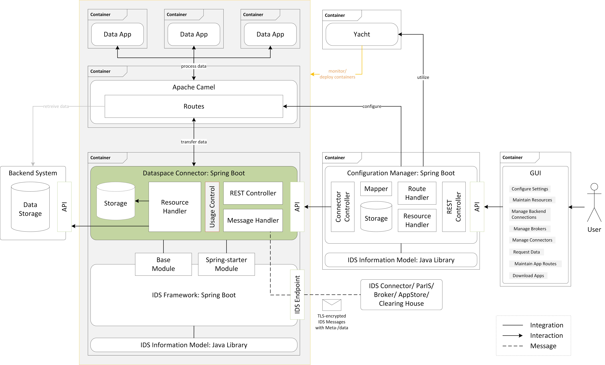
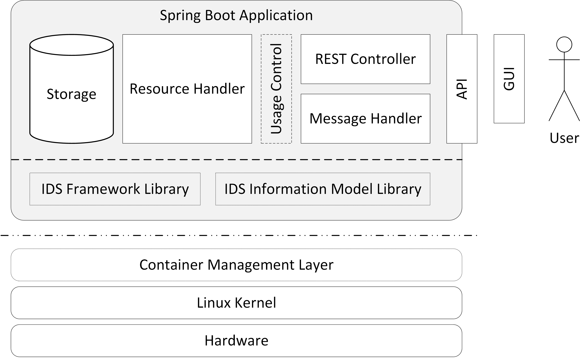
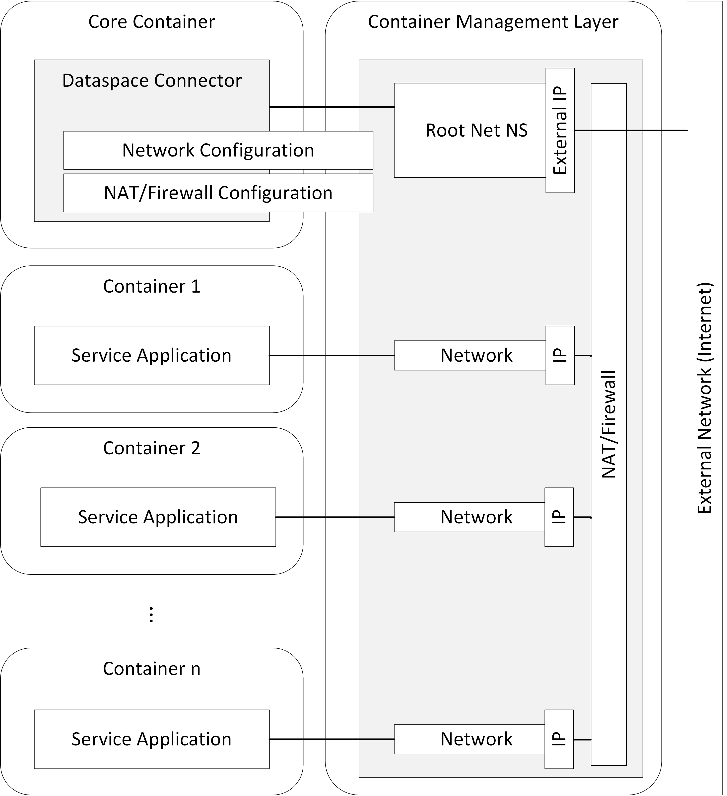
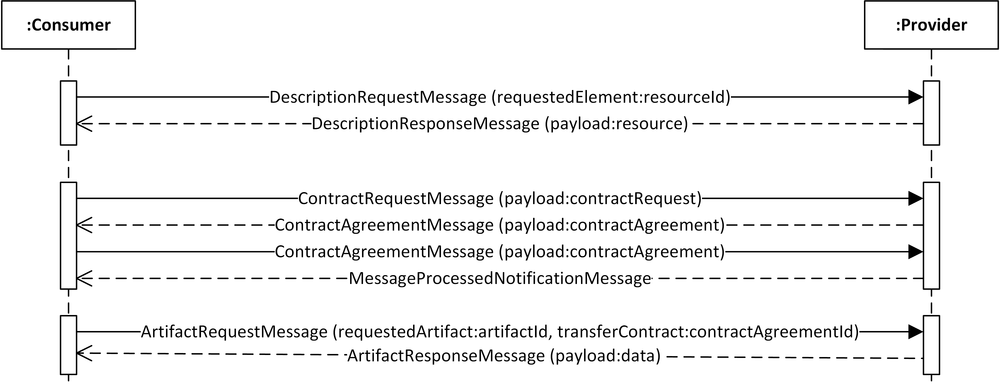
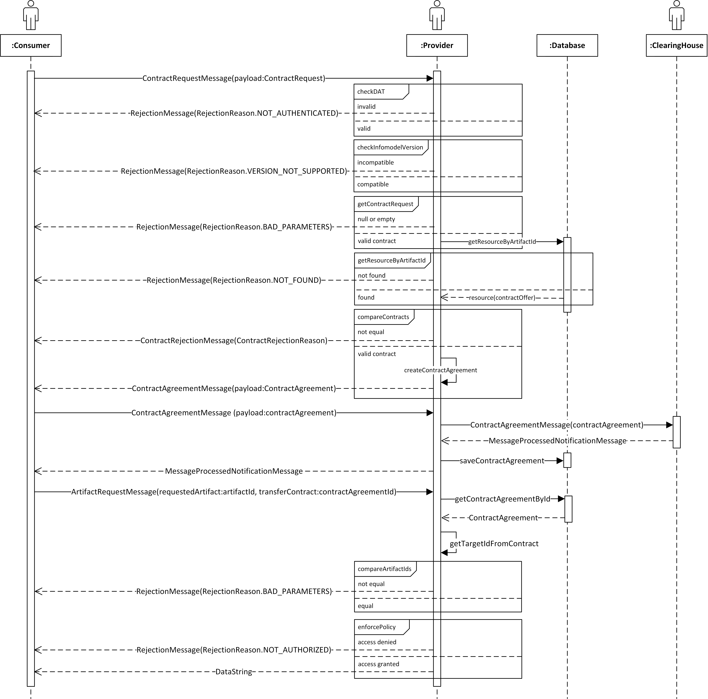

## Architecture

### Connector Setup

The following illustration visualizes the interaction of the Dataspace Connector, the
[IDS Framework](https://github.com/FraunhoferISST/IDS-Connector-Framework), the
[Configuration Manager](https://github.com/FraunhoferISST/IDS-ConfigurationManager), and it's 
[GUI](https://github.com/International-Data-Spaces-Association/IDS-ConfigurationManager-UI). All components have a defined API that allows 
individual components to be removed or replaced. The Dataspace Connector can be deployed standalone 
and can be connected to existing backend systems. Configuration Manager and GUI facilitate the operation 
and configuration of the connector. If desired, the Dataspace Connector may be replaced by another 
connector implementation, either integrating the IDS Framework or not.

For the use of data apps, the data exchange between these and the Dataspace Connector takes place
by using an integration framework, such as Apache Camel, via the defined APIs.
To keep the Dataspace Connector as lightweight and modular as possible, frameworks like Apache Camel
will not be directly integrated into the core container. Instead, they are executed in parallel
and can thus be easily replaced by other frameworks, e.g. Apache Airflow.
The Configuration Manager defines and manages the routes at connector runtime and can thereby control 
the data flow between different systems and apps. A monitoring system, e.g. Yacht (next to or inside 
the Configuration Manager), helps to monitor and manage the loads of the individual components, 
download images, and start or stop pods/containers.

### Connector Architecture
The Dataspace Connector is a Java application following basic Spring Boot functionalities and 
architecture patterns. It currently supports the IDS Information Model version 4.0.0 and integrates 
the IDS Connector Framework Library for IDS functionalities and message handling. It provides a 
REST API for loading, updating, and deleting IDS persisted resources in a local database. 

### Network Architecture
The Connector will support a segmented network. Every running container will be associated to a 
different network zone by providing its own virtual network stack. The Connector as the core 
container will have root rights and be able to manage network and firewall configurations for all 
separated containers and their networks. As root namespace, it provides an external IP and can be 
reached from an external network. 

## Class Diagrams

## Process Diagrams

## Sequence Diagrams

### Metadata & Data Exchange

### Policy Negotiation

## Supported IDS Messages

| IDS Message Type                    | Outgoing           | Incoming | Description              |
|:------------------------------------|:-------------------|----------|--------------------------|
| `ArtifactRequestMessage`              | request            | x        | message asking for retrieving a specified artifact  |
| `DescriptionRequestMessage`           | request            | x        | message requesting metadata (If no URI is supplied via the ids:requestedElement field, this messages is treated like a self-description request.) |
| `ContractRequestMessage`              | request            | x        | message containing a contract offer |
| `ArtifactResponseMessage`             | response           |          | message that contains the artifact's data in the payload |
| `DescriptionResponseMessage`          | response           |          | message containing the metadata of a requested object |
| `ContractAgreementMessage`            | request + response |          | message containing a contract agreement |
| `ContractRejectionMessage`            | response           |          | message indicating rejection of a contract |
| `RejectionMessage`                    | response           |          | message that notified the sender of a message that processing of the request message has failed |
| `NotificationMessage`                 | request            | x        | message is informative and no response is expected |
| `LogMessage`                          | request            |          | message that is used to transfer logs e.g. to the clearing house |
| `MessageProcessedNotificationMessage` | response           |          | notification that a message has been successfully processed |
| `ConnectorUpdateMessage`              | request            |          | message notifying the recipient(s) about the availability and current configuration of a connector |
| `ConnectorUnavailableMessage`         | request            |          | message indicating that a specific connector is unavailable |
| `ResourceUpdateMessage`               | request            |          | message indicating the availability and current description of a specific resource |
| `ResourceUnavailableMessage`          | request            |          | message indicating that a specific resource is unavailable |
| `QueryMessage`                        | request            |          | message intended to be consumed by specific components |

`request` = initially send this kind of IDS message | `response` = response with this IDS message
