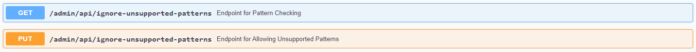

The Dataspace Connector supports usage policies written in an IDS specific policy language following 
the [ODRL](https://www.w3.org/TR/odrl-model/#policy) standard. Using this, the Dataspace Connector 
does not support all specified attributes, but the ones to handle eight selected patterns. 

Example policies for each of them can be found by using the endpoint `POST /admin/api/example/usage-policy`.
- **Provide Access**: provides data usage without any restrictions
- **Prohibit Access**: prohibits the data usage
- **Usage During Interval**: provides data usage within a specified time interval (start + end date)
- **N Times Usage**: allows data usage for n times
- **Duration Usage**: allows data usage for a specified time period (xsd:duration)
- **Usage Until Deletion**: allows data usage within a specified time interval with the restriction 
to delete it at a specified time stamp (xsd:datetime)
- **Usage Logging**: allows data usage if logged to the Clearing House
- **Usage Notification**: allows data usage with notification message (notification endpoint URI)
- **Connector Restricted Usage**: allows data usage for a specific connector (connector ID)

The usage policy is added to the metadata of a resource. 
The classes at `src/main/java/de/fraunhofer/isst/dataspaceconnector/services/usagecontrol` read, 
classify, verify, and enforce the policies at runtime. There are three points in time when the 
policies are checked. We distinguish between the provider side and the consumer side.

## Policy Check at Data Provider

When the data provider receives an `ArtifactRequestMessage` from an external connector, the 
`ArtifactMessageHandler` checks the pattern of the policy that was added to the requested resource. 
If the pattern matches one of the following five, an appropriate policy check is performed: 
`PROVIDE_ACCESS`, `PROHIBIT_ACCESS`, `USAGE_DURING_INTERVAL`, `USAGE_UNTIL_DELETION` or `CONNECTOR_RESTRICTED_USAGE`. 

Depending on the specified rules, the access permission will be set to true or false.
If it is true, the data provider returns the data. If not, it will respond with a 
`RejectionReason.NOT_AUTHORIZED`.

## Policy Check at Data Consumer

After the requested data and its metadata are saved in the connector's internal database, it can be 
accessed by using the according endpoint. If the user wants to get the data from the data consumer's 
database, the usage policies of the requested data resource are checked for the following patterns: 
`USAGE_DURING_INTERVAL`, `DURATION_USAGE`, `USAGE_UNTIL_DELETION`, `USAGE_LOGGING`, 
`USAGE_NOTIFICATION`, and `N_TIMES_USAGE`. The policy is then implemented using the detected pattern. 

As described above, depending on the rule values, the access permission will be set to true or 
false, and correspondingly, the data is either displayed or not.

On top of that, the `PolicyEnforcement.schedule()` method performs a policy check every minute. If 
a duty determining the deletion date and time, as in `USAGE_UNTIL_DELETION`, is detected, usage 
control is executed.

> **Note**: The Dataspace Connector is able to received resources with usage policies that do not follow
> the eight supported patterns. As, by default, the policy check on the data consumer side would not 
> allow to access data whose policies cannot be enforced, you are able to ignore unsupported patterns
> with setting the boolean at endpoint `/admin/api/ignore-unsupported-patterns` to `true`. As a data 
> consumer, you are bound to the contract agreement and therefore, you have to ensure, that your 
> backend applications enforce the usage policies instead.
>
> 
